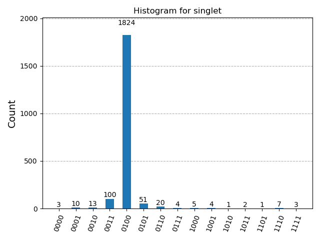
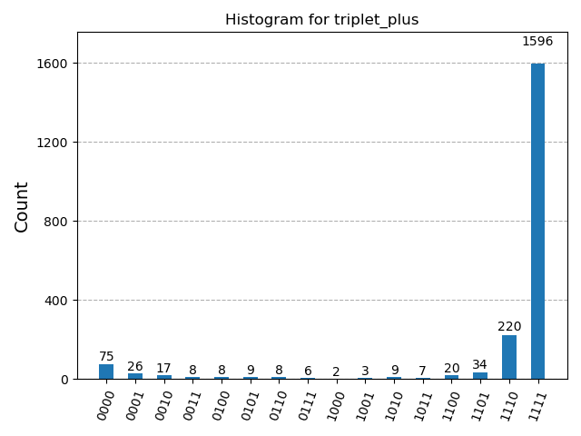
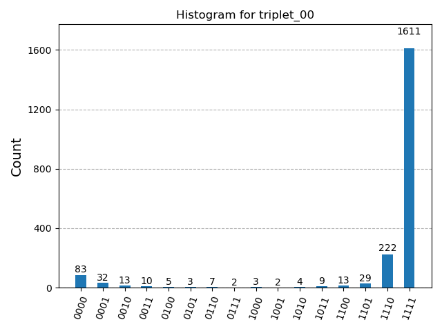
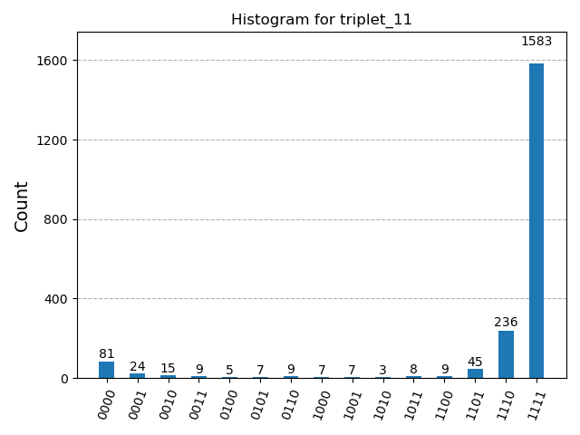

# Quantum Simulation of the Two-Site Isotropic Heisenberg Model via QPE

This repository contains the complete implementation and simulation framework for resolving the energy eigenvalues of a two-site isotropic Heisenberg model using **Quantum Phase Estimation (QPE)** and **Phase Kickback** inside IBM's Qiskit environment.

## 📌 Project Overview
Classical exact numerical diagonalization scales exponentially as $2^N$. This project demonstrates how digital quantum simulators can native-map physical interaction terms ($X\otimes X$, $Y\otimes Y$, $Z\otimes Z$) without Trotterization constraints, because the isotropic components commute pairwise.

### Key Results
* **Singlet Ground State ($E_0 = -3J$):** Decoded to phase `0.2500` ($\approx 4.7\%$ discretization error using a 4-bit counting register).
* **Triplet Excited States ($E_1, E_2, E_3 = +1J$):** Confirmed threefold physical degeneracy via a convergent peak at phase `0.9375` (wrapped to `-0.0625`).

---

## 🛠️ Installation & Setup

### Approach 1: Run via Local Environment
To run this simulation on your local machine, follow these steps sequentially:

1. **Clone the repository and enter the directory:**
   ```bash
   git clone [https://github.com/laith-alissa/Quantum-Heisenberg-QPE.git](https://github.com/laith-alissa/Quantum-Heisenberg-QPE.git)
   cd Quantum-Heisenberg-QPE
   ```

2. **Install the required dependencies:**
   ```bash
   pip install -r requirements.txt
   ```

3. **Launch the Jupyter interface:**
   ```bash
   jupyter notebook heisenberg_qpe.ipynb
   ```

### Approach 2: Direct Interactive Notebook
Alternatively, you can skip local environment configuration entirely by opening the included `heisenberg_qpe.ipynb` notebook directly in an interactive cloud environment like GitHub Codespaces, Google Colab, or the IBM Quantum Platform.

---

## 📊 Visualizations

### Circuit Pipeline
The 4-bit counting register layout utilizing controlled Pauli interaction channels:


### Measurement Outcomes
| Singlet Ground State (`0100`) | Triplet State (`1111`) |
|---|---|
|  |   |

---

## 📄 References
* Oliveira, M. G. J., Antão, T. V. C., & Peres, N. M. R. (2024). *The two-site Heisenberg model studied using a quantum computer: A didactic introduction.* Revista Brasileira de Ensino de Física.
* Nielsen, M. A., & Chuang, I. L. (2010). *Quantum Computation and Quantum Information.*
