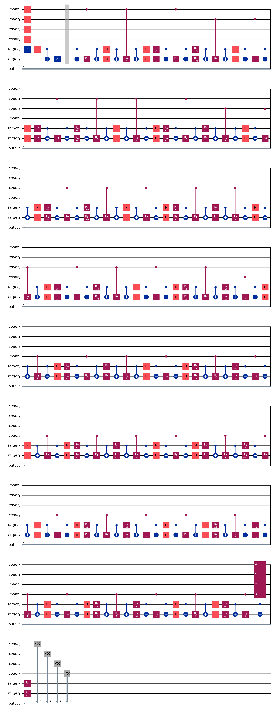
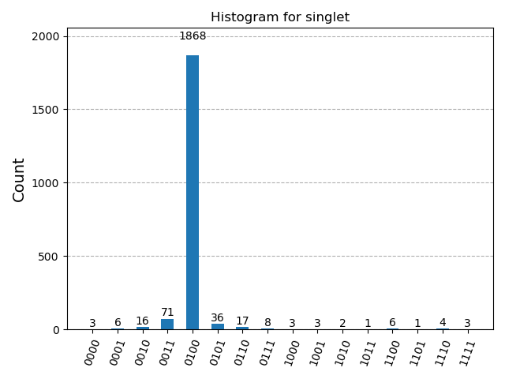
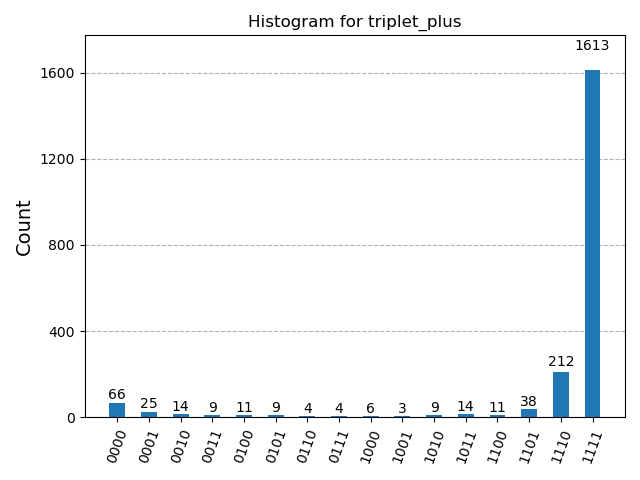
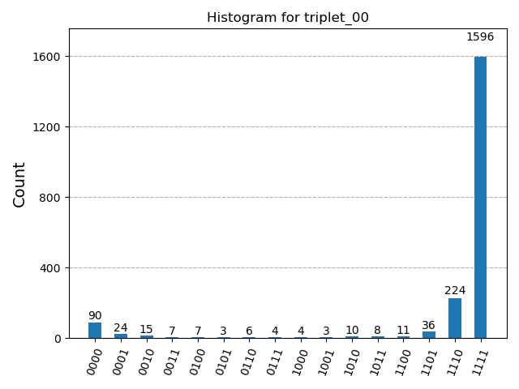
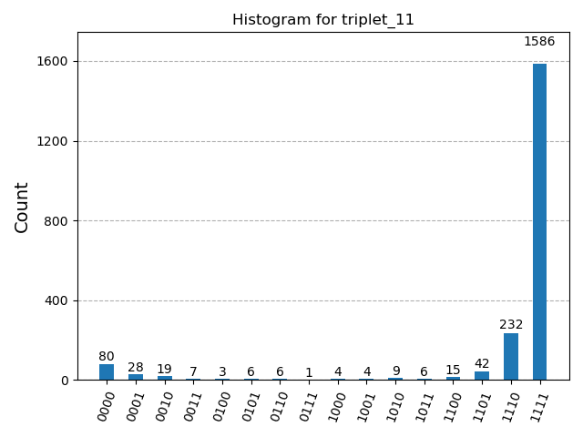
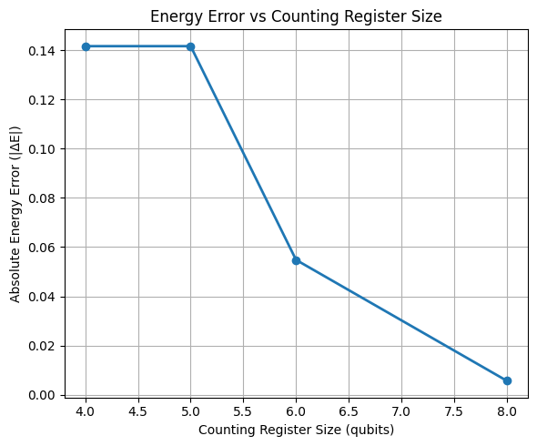
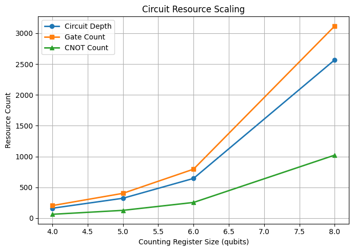

# Simulation Visualizations

This file aggregates the architectural circuit pipeline and the statistical measurement results generated by running the Quantum Phase Estimation (QPE) simulation on the two-site isotropic Heisenberg model.

---

## 🔌 Complete Quantum Circuit Pipeline

The following image illustrates the full 4-bit counting register pipeline compiled into hardware-native controlled-$ZZ$, controlled-$XX$, and controlled-$YY$ interactions, followed by the inverse Quantum Fourier Transform ($QFT^\dagger$) and measurement.

---

## 📊 Measurement Histograms & Outputs

The simulation runs over 2048 shots on the noiseless `AerSimulator` statevector backend. The resulting distributions successfully distinguish the singlet ground state from the degenerate triplet excited states.

### 1. Singlet Ground State ($E_0 = -3J$)
Returns the binary bitstring `0100`, which correctly decodes to an estimated energy value of $-3.1416J$.

### 2. Triplet Excited States ($E_1, E_2, E_3 = +1J$)
All three prepared triplet eigenstates converge identically to the binary bitstring `1111`, proving the physical threefold degeneracy predicted by exact classical matrix diagonalization.

* **Prepared State:** $|\psi_{\text{triplet}}\rangle = \frac{1}{\sqrt{2}}(|01\rangle + |10\rangle)$
  
  

* **Prepared State:** $|00\rangle$
  
  

* **Prepared State:** $|11\rangle$
  
  

## 📊 Counting Regiester Scaling Analysis

The figure conducted to describe the effect of scaling up the counting register from $n=4$ up to $n=8$ on the singlet state energy, taking the singlet error from about 14\% down to under 1\%

   

The figure describing growth of transpiled circuit depth, total gate count, and CNOT count as the number of counting qubits increases.

  

